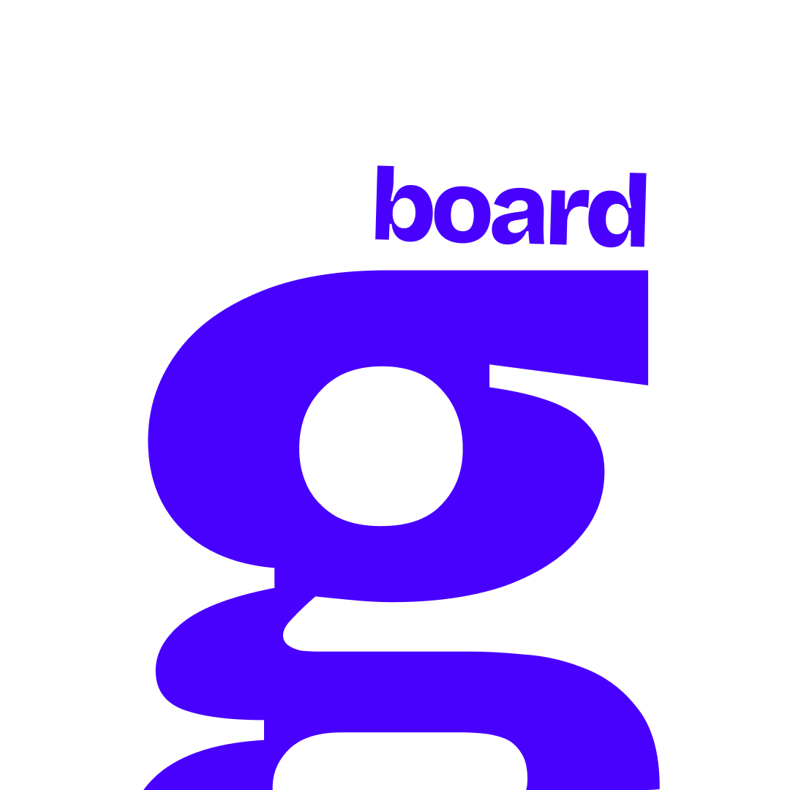

<div align="center">
  

  <h1>Glyph</h1>

  <p><strong>A fast, keyboard-first clipboard manager for macOS, Windows, and Linux.</strong></p>

  <p>
    
    
    
  </p>
</div>

---

## Features

- **Persistent clipboard history** — text and images, kept across restarts.
- **Pin items** so they never get auto-pruned, regardless of history limits.
- **Groups with custom icons** — file your snippets, links, and code blocks into named categories from a 35-icon library.
- **Fuzzy search** across the entire history.
- **Quick paste** — `⌘1`–`⌘9` to paste any of the top nine items without leaving your keyboard.
- **QR code** for any text item — scan it from your phone instead of e-mailing it to yourself.
- **Customizable global shortcut** to toggle the window from anywhere.
- **System tray** support; runs as an accessory app on macOS (no dock icon).
- **Light / dark / system** theme.
- **Auto-start on login**, **always-on-top**, and **hide-on-blur** are all togglable.
- **Cross-platform** — macOS, Windows, and Linux from a single Rust + React codebase.

## Screenshots

> Place your captures in `public/` and link them here. Suggested set: main list, group filter, settings, QR modal.

## Installation

Pre-built artifacts are published on the [Releases page](https://github.com/USERNAME/glyph/releases).

### macOS

1. Download `Glyphs_x.y.z_aarch64.dmg` (Apple Silicon) or `Glyphs_x.y.z_x64.dmg` (Intel).
2. Open the `.dmg` and drag **Glyphs** to your Applications folder.
3. Launch it. The first run will ask for *Accessibility* permission so it can simulate `⌘V` when you click an item — grant it under **System Settings → Privacy & Security → Accessibility**.
4. Press the global shortcut (`⌘B` by default) to toggle the window.

### Windows

1. Download `Glyphs_x.y.z_x64-setup.msi`.
2. Run the installer.
3. Launch from the Start Menu or system tray.

### Linux

1. Download the `.AppImage` or `.deb` artifact.
2. **AppImage**: `chmod +x Glyphs_x.y.z_amd64.AppImage && ./Glyphs_x.y.z_amd64.AppImage`.
3. **Debian/Ubuntu**: `sudo dpkg -i Glyphs_x.y.z_amd64.deb`.
4. Launch from your application launcher.

## Build from source

Glyph uses Tauri 2. Install the Tauri prerequisites for your OS first: <https://v2.tauri.app/start/prerequisites/>.

```sh
git clone https://github.com/USERNAME/glyph.git
cd glyph
npm install

# Development (hot-reloading dev build)
npm run tauri:dev

# Release artifact for your current OS
npm run tauri:build
```

The built binary lands in `src-tauri/target/release/bundle/`.

### Required toolchains

- **Node.js** 20 or newer
- **Rust** 1.77.2 or newer (the version pinned in `src-tauri/Cargo.toml`)
- Platform deps documented at the Tauri prerequisites link above.

## Usage

Open Glyph with the global shortcut (default `⌘B` on macOS, `Ctrl+B` on Windows/Linux). Navigate with the keyboard:

| Action                      | Shortcut                |
| --------------------------- | ----------------------- |
| Focus search                | `⌘ K`                   |
| Move selection              | `↑` / `↓` or `J` / `K`  |
| Switch group                | `H` / `L`               |
| Paste selected              | `Enter`                 |
| Paste as plain text         | `Shift + Enter`         |
| Quick-paste item N          | `⌘ 1`–`⌘ 9`             |
| Pin / unpin selected        | `P`                     |
| Delete selected             | `⌘ D`                   |
| Create new group            | `⌘ G`                   |
| Open settings               | `⌘ ,`                   |
| Show shortcuts dialog       | `?`                     |
| Hide window / clear search  | `Esc` or `⌘ [`          |

The full list also lives in-app at the `?` shortcut.

## Configuration

Open **Settings** with `⌘,` (or the gear icon in the footer). Available controls:

- **Launch on login** — start Glyph automatically when you sign in.
- **Max history items** — soft cap on unpinned items (10–500). Pinned items are never auto-trimmed.
- **Toggle Glyph shortcut** — record a new global shortcut. Conflicts with other apps are detected before persisting.
- **Theme** — System / Light / Dark.
- **Always on top** — keep Glyph above other windows when shown.
- **Hide when window loses focus** — auto-close as soon as another app takes focus.
- **Show footer** — hide the bottom hint bar to reclaim screen space.
- **Reset** — wipe history, groups, and settings.

Settings are persisted via `tauri-plugin-store` and survive restarts.

## Tech stack

- **Frontend** — React 18, Zustand, Tailwind CSS v4, Lucide icons.
- **Shell** — Tauri 2.
- **Backend** — Rust, with `arboard` (clipboard read/write), `clipboard-master` (cross-platform watcher), `tauri-plugin-store` (persistence), `tauri-plugin-global-shortcut` (system-wide hotkey), `tauri-plugin-autostart` (login items), and `enigo` / `osascript` / `xdotool` for synthetic paste keystrokes.

## Project structure

```
glyph/
├── public/                    static assets (icon, screenshots)
├── src/                       React app
│   ├── App.tsx
│   ├── components/            shared UI primitives (Kbd, …)
│   ├── features/
│   │   ├── clipboard/         list, item row, modals, shortcut hook
│   │   └── settings/          settings page, recorder, toggles
│   └── store/                 Zustand store (talks to Tauri commands)
├── src-tauri/                 Rust backend
│   ├── src/
│   │   ├── lib.rs             plugin wiring, tray, window toggle
│   │   ├── commands.rs        all #[tauri::command] entry points
│   │   ├── clipboard_watcher.rs
│   │   └── store.rs           data shape + persisted helpers
│   ├── capabilities/          Tauri permission scopes
│   └── tauri.conf.json
└── ...
```

## Contributing

Issues and PRs are welcome. Please read **[CONTRIBUTING.md](CONTRIBUTING.md)** before opening a PR — it covers local setup, expected code style, and the pre-submission checklist. By participating you agree to abide by the [Code of Conduct](CODE_OF_CONDUCT.md). Security issues should follow the disclosure process in [SECURITY.md](SECURITY.md).

Looking for somewhere to start? Search the [issues](https://github.com/USERNAME/glyph/issues) for the `good first issue` label, or pick one of the open areas listed in `CONTRIBUTING.md`.

## License

[MIT](LICENSE) © Glyph Contributors.
